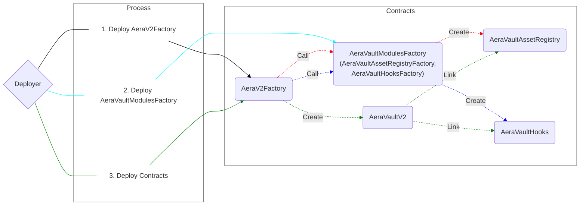

# Aera Protocol V2

[](https://github.com/GauntletNetworks/aera-contracts-v2/actions/workflows/forge.yml)

Tools used:

- [Foundry](https://github.com/foundry-rs/foundry): Compile and run the smart contracts on a local development network
- [Slither](https://github.com/crytic/slither): solidity analyzer
- [Solhint](https://github.com/protofire/solhint): linter
- [Prettier Plugin Solidity](https://github.com/prettier-solidity/prettier-plugin-solidity): code formatter

## Usage

### Pre Requisites

Before running any command, make sure to install dependencies:

```sh
$ yarn install
$ forge install
```

After that, copy the example environment file into an `.env` file like so:

```sh
$ cp .env.example .env
```

Team secrets are managed in [GCP secret manager](https://console.cloud.google.com/security/secret-manager?project=gauntlet-sim). If you don't have access, you need to be added to engineering@gauntlet.network

### Compile

Compile the smart contracts with Forge:

```sh
$ forge build
```

### Analyze Solidity

Analyze the Solidity code:

```sh
$ yarn slither
```

### Lint Solidity

Lint the Solidity code:

```sh
$ yarn lint:sol
```

### Test

Run the forge tests:

```sh
$ forge test
```

Tests run against forks of target environments (ie Mainnet, Polygon) and require a node provider to be authenticated in your [.env](./.env).

### Coverage

Generate the coverage report with env variables:

```sh
$ forge coverage
```

Generate the coverage report as lcov with env variables:

```sh
$ forge coverage --report lcov
```

### Report Gas

See the gas usage per unit test and average gas per method call:

```sh
$ forge test --gas-report
```

### Clean

Delete the smart contract artifacts and cache directories:

```sh
$ forge clean
```

### Deploy

Prior to deployment, make sure you have provided private key or mnemonic in your environment. If private key exists, it uses the private key, otherwise, it uses mnemonic.
And you should specify the parameters in configs.
To do this, copy the example config files without the `.example` name in `/config` path.
If you left `owner` with zero address, the deployer will be the owner of deployed contracts.

Deploy the AeraV2Factory to a specific network:

```sh
$ forge script script/v2/deploy/DeployAeraV2Factory.s.sol --fork-url <URL> --broadcast
```

Deploy the AeraVaultModulesFactory to a specific network:

```sh
$ forge script script/v2/deploy/DeployAeraVaultModulesFactory.s.sol --fork-url <URL> --broadcast
```

Deploy the AeraVaultV2, AeraVaultAssetRegistry and AeraVaultHooks to a specific network with salt value:

```sh
$ forge script script/v2/deploy/DeployAeraContracts.s.sol --fork-url <URL> --broadcast --sig "run(bytes32)" <SALT>
```

You can omit `--sig "run(bytes32)" <SALT>` to use `0x00` for salt value.

```sh
$ forge script script/v2/deploy/DeployAeraContracts.s.sol --fork-url <URL> --broadcast
```

Once the deployments are done, the deployed addresses will be stored in the `/config/Deployments.json` file.
If you want to run the tests with the deployed contracts, you need to specify the deployment addresses in the file, and set `TEST_WITH_DEPLOYED_CONTRACTS` as `true`.
Then just run the tests.

### Scripts

Similar to deployment, make sure you have a private key available

Pause a vault:
```sh
$ VAULT_ADDRESS=<vault_address> forge script script/v2/Pause.s.sol --rpc <URL> --broadcast
```

Resume a vault:
```sh
$ VAULT_ADDRESS=<vault_address> forge script script/v2/Resume.s.sol --rpc <URL> --broadcast
```

Deposit to a vault:
First set the amounts and vault address in config/AeraVaultDeposit.json
```sh
$ forge script script/v2/Deposit.s.sol --rpc <URL> --broadcast
```

Withdraw from a vault:
First set the amounts and vault address in config/AeraVaultWithdraw.json
```sh
$ forge script script/v2/Withdraw.s.sol --rpc <URL> --broadcast
```

Add assets to registry:
First set the asset information in config/AddAssetsToRegistry.json
```sh
$ forge script script/v2/AddAssetsToRegistry.s.sol --rpc <URL> --broadcast
```

Remove assets from registry:
First set the assets to remove in config/RemoveAssetsFromRegistry.json
```sh
$ forge script script/v2/RemoveAssetsFromRegistry.s.sol --rpc <URL> --broadcast
```

Transfer a vault's ownership:
```sh
$ VAULT_ADDRESS=<vault_address> NEW_OWNER=<new_owner> forge script script/v2/TransferOwnership.s.sol --rpc <URL> --broadcast
```

#### Deployment Flow



## Syntax Highlighting

If you use VSCode, you can enjoy syntax highlighting for your Solidity code via the
[vscode-solidity](https://github.com/juanfranblanco/vscode-solidity) extension. The recommended approach to set the
compiler version is to add the following fields to your VSCode user settings:

```json
{
  "solidity.compileUsingRemoteVersion": "v0.8.21",
  "solidity.defaultCompiler": "remote"
}
```

Where of course `v0.8.21` can be replaced with any other version.
